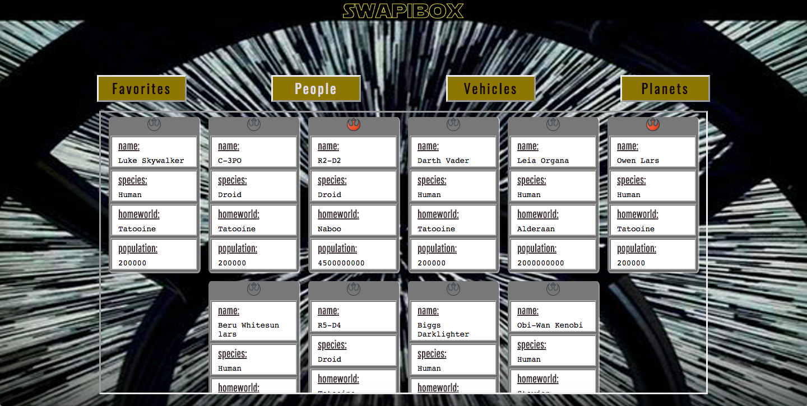

# SWapiBox

### Overview  
SwapiBox provides Star Wars data fetched from SWapi.co. Built for Star Wars fans, it allows users to look at a series of data cards by clicking on one of 3 category buttons and saving any cards to 'favorites' via local storage.

### What I learned  
With this project I focused on gaining more fluency with React and improving my test writing skills. My learning take away was the importance of spending more time planning the organization of the app architecture and wireframing my components.

### Example 
   

### Technologies  
React - Jest - Enzyme  

### Tools  
[The Star Wars API](https://swapi.co/) - GitHub Projects
